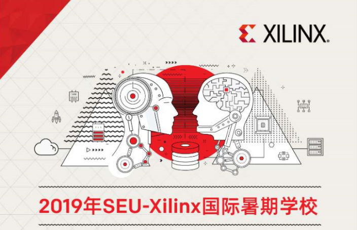
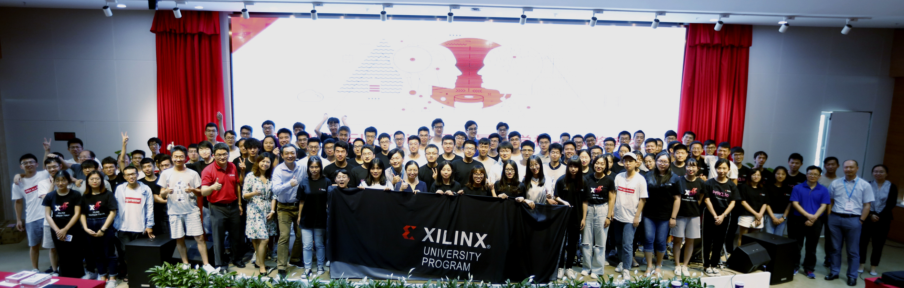

# 2019 SEU-Xilinx International Summer Camp

2019 SEU-Xilinx International Summer Camp was conducted in NanJing city, from 7th July to 19th July and there were 112 trainees from 70+ different schools all over the world. The training was separated into 2 phases, 5-day-long lectures and  7-day-long project execution 

This repository contains all the designs that submitted by trainees in summer camp, if you can not find the project of your team, please contact with me @weli@xilinx.com. 

2019 SEU-Xilinx暑期学校从7月7日到7月19日，在南京举办，为期12天，共有112名来自70多所高校的学员参加，培训包括5天的技术培训/专家讲座和7天的动手项目。

本仓库用于存放动手项目阶段的所有项目源码、操作手册和技术笔记等内容，如果在仓库中没有发现你所在小组的项目，请联系我。weli@xilinx.com

## Group Photo (合照)

## Project List（完整的项目列表）

The reports of the projects are in [XilinxSummerCampReports ](./xilinxSummerCampReports).

各个项目的报告在[XilinxSummerCampReports](./xilinxSummerCampReports)目录下。

The details of the projects are shown as follow.

各个项目的详细信息如下所示：

No. | Platform | Team Member | Project Name 
-|-|-|-
1|Ultra96|鲍春、胡心雨、常乐|[基于Ultra96的行人检测系统](https://github.com/EdwardBao1006/SSD_detection_by_DPU_on_Ultra_96.git)
2|PYNQ-Z2|李明莉、葛倍倍、钱佳、张俊杰|基于PYNQ的调酒机器人设计
3|AWS|朱泳波、陆志成、刘中元、姚汉梅|[SDAceel环境下的CRC算法加速](https://github.com/jojo-oop/SDAccel)
5|PYNQ-Z2|赵剑飞、刘业扬、刘荪荟|基于SURF特征的实时角度测量
6|PYNQ-Z2|吴欣茹、黄婧雯、唐轩、仲海兵| [变色相机](https://github.com/wuxinruru/HLS_xfopencv.git)
7|PYNQ-Z2|李文涛、苗壮、胡遵阳|[数电课程实验](https://github.com/CCP101/Digital_circuit_experiment)
8|PYNQ-Z2|李玉振、王家豪、周乾|数字字符识别
9|PYNQ-Z2|王奕闵、周义其、王智恒、曹子奇|数字识别
13|SEA-S7|张泽欢、刘威壮、凌瑾、徐小清|[数字字符识别](https://github.com/liuweistrong/Digital-Recognition)
14|SEA-S7|王文杰、许巾一、何群芳|自动路标识别巡线平衡车
15|SEA-S7|王路、姜亚超、陈光磊、田蕾|基于SEA-S7平台的小球追踪
16|SEA-S7|戴荣时、程嘉轩、张陈睿、孙沐天|基于SEA-S7的二维码识别系统
17|Ultra96|杜江溯、古奕康、陈志炜、刘璐|[基于DPU 加速的深度学习人脸识别与颜值评估](https://github.com/dujiangsu/FaceScore-Accelerated-by-Xilinx-DPU.git)
18|Ultra96|谭祖雄、崔傲、张伟枫、赵天翼|DNN 加速器硬件实现与优化
19|Ultra96|刘泽世、石正源、侯兴中|[基于Ultra96和DPU的人脸检测应用](https://github.com/Ace-Pegasus/DPU)
20|Ultra96|彭锋、董金陇、闫宇航|[基于DPU的人脸识别与检测](https://github.com/FengPenggo/Create-caffe.model-on-caffe-)
21|SEA-S7|谭正奇、谭静柔、刘卓君、宋玉洁|示波器 - 任意波形发生器
25|Ultra96|林晓波、许运丰、刘杨琳、刘扬|[基于FPGA的高帧率目标检测系统设计](https://github.com/xilinxfairchild/FPGABasedHighPerformanceTargetChecking.git)
26|PYNQ-Z2|萧嘉乐、袁霄亮、孔昶|[高帧率Respeaker方位识别与语言识别及在AWS上的物联网应用](https://github.com/CarlosShiu/Pynq-Respeaker-DOA-Vivado.git)
27|PYNQ-Z2|赵颖渊、李辉、曹新野|[电子音乐生成、效果器](https://github.com/LexPG12138/Xilinx_MUSIC.git)
28|PYNQ-Z2|周聪、马慧宇、马丽萍|Respeaker解码及定位
29|PYNQ-Z2|陈晨、叶进取、牟德增|[基于PYNQ的交通标志检测系统](https://github.com/51184501129/Traffic-Light-Detection.git)
30|PYNQ-Z2|李响、张书瑜、彭滨|[基于PYNQ的肤色检测算法](https://github.com/pb8948/skin_dection)
31|PYNQ-Z2|吴玮琳、刘鹏晨|[红绿灯识别及反馈](https://github.com/51184501129/Traffic-Light-Detection.git)
32|PYNQ-Z2|洪刚、白鹏程、刘海军、王琳|车道线检测
33|PYNQ-Z2|贾广瑞、赵凡、陈欣怡、杨悦|行人模型检测
35|PYNQ-Z2|潘银飞、杨静磊、朱浩哲、林立宇|[双目立体视觉](https://github.com/zhutmost/stereo-vision-fpga.git)
36|PYNQ-Z2|秦树洋、薛臻、纪云鹏|卷积神经网络加速器

# Contribute（贡献）

Please continue to optimize the designs.

虽然暑期学校已经结束，我们依然欢迎大家不继续改进设计，并提交修订版的代码和文档到github中。
